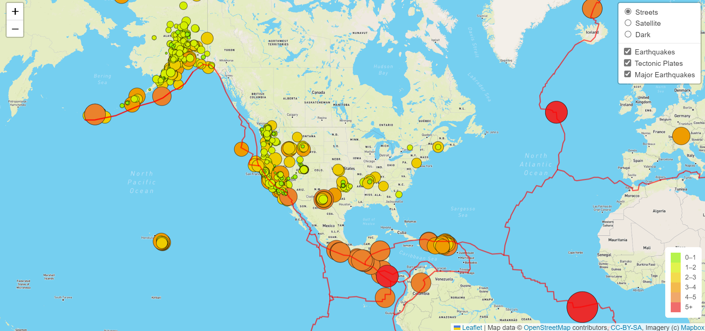

# Mapping Earthquakes

## Overview

- This analysis uses Leaflet and Mapbox JavaScript libraries to create an interactive map depicting earthquake data from the past 7 days.
- Accomplishing this task required using API requests to Mapbox, manipulating styles using the JavaScript Leaflet library, and using D3 to access GeoJSON data.

## Results

- This analysis results in a dynamic map that toggles between 3 Mapbox styles:
    1. Streets
    2. Satellite
    3. Dark

- The map loads with all 3 layers displayed:
    1. Circles that mark the location of each earthquake from the past 7 days.
        - The color and size correspond to the magnitude, as described by the legend.
        - Data sourced from USGS.
    2. The tectonic plates. 
    3. Circles that mark the the location of each earthquake with a magnitude of greater than 4.5.
        - The color and size correspond to the magnitude.
        - Data sourced from USGS

- Each layer can be toggled on or off individually:

## Summary

- This analysis brings together API requests, JavaScript, and functional programming while visualizing data in a creative and attractive manner. 

- Suggestions for improvement on this code:
    - The legend scale could be changed slightly to account for the earthquakes with a magnitude over 4.5.
